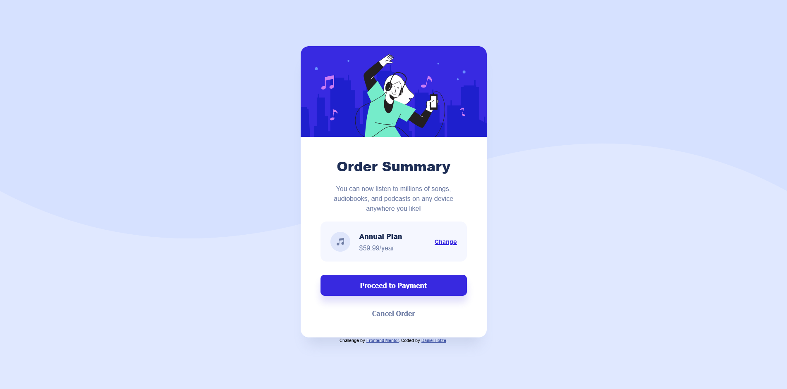

# Frontend Mentor - Order summary card solution

This is a solution to the [Order summary card challenge on Frontend Mentor](https://www.frontendmentor.io/challenges/order-summary-component-QlPmajDUj). Frontend Mentor challenges help you improve your coding skills by building realistic projects. 

## Table of contents

- [Overview](#overview)
  - [The challenge](#the-challenge)
  - [Screenshot](#screenshot)
  - [Links](#links)
- [My process](#my-process)
  - [Built with](#built-with)
  - [What I learned](#what-i-learned)
  - [Continued development](#continued-development)
  - [Useful resources](#useful-resources)
- [Author](#author)

## Overview

### The challenge

Users should be able to:

- See hover states for interactive elements

### Screenshot

### Links

- Solution URL: [Add solution URL here](https://github.com/DeveloperDwarf/FrontEnd-Mentor/tree/main/order-summary-component-main)
- Live Site URL: [Add live site URL here](https://DeveloperDwarf.github.io/)

## My process

### Built with

- Semantic HTML5 markup
- CSS custom properties
- Flexbox

### What I learned
I learned how to make a custom card component for a order summary. In the process I learned about flexbox basics to make the layout of the site and many other css features like media queries or the box-shadow attribute which I didnt use before. I also learned how to select and manipulate colors with hsl and how to create hover-effects with it.

### Continued development

The next small projects I will work on will also be HTML/CSS beginner Challenges from frontendmentor to become more comfortable with writing HTML/CSS. I especially want to learn more about layout. After I learned more about flexbox and grid and collected more html/css knowledge on the way I will move on to learn Bootstrap as a framework for web development and also tackle javascript.
After learning the basics of those more challenges will follow.
Once I am more confident in my Frontend abilities I will start learning about the Backend. I am in for a long but most likely awesome journey!

### Useful resources

- [CSS-Tricks Flexbox Guide](https://css-tricks.com/snippets/css/a-guide-to-flexbox/) - This helped me a lot with understanding the basics of using Flexbox layout. Gonna come back to this one for my next projects aswell till I am really good at using it.
- [MDN Webdocs](https://developer.mozilla.org/de/docs/Web/CSS) - This one is always great to search for things I dont remember anymore or when I dont know how to use a property. The tutorials are pretty good aswell.
- [Stackoverflow](https://stackoverflow.com/) - We know it, we love it. Always helps you out when you get really stuck on a problem and need a hint on how to progress. When you have a problem, somebody probably had it aswell and asked for help on the internet.

## Author

- Frontend Mentor - [@yourusername](https://www.frontendmentor.io/profile/DeveloperDwarf)
